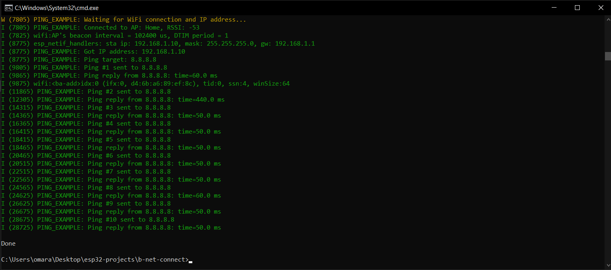

# ESP32 WiFi Ping Example

Simple ESP32 project that connects to WiFi and pings a website.

## Setup
1. Update `WIFI_SSID` and `WIFI_PASSWORD` in the code
2. Optionally change `PING_TARGET` (default: www.google.com)

## How It Works
1. Connects to WiFi using your credentials
2. Resolves hostname to IP address using DNS
3. Sends ICMP echo requests (pings)
4. Measures and displays round-trip time

## Serial Monitor Output

