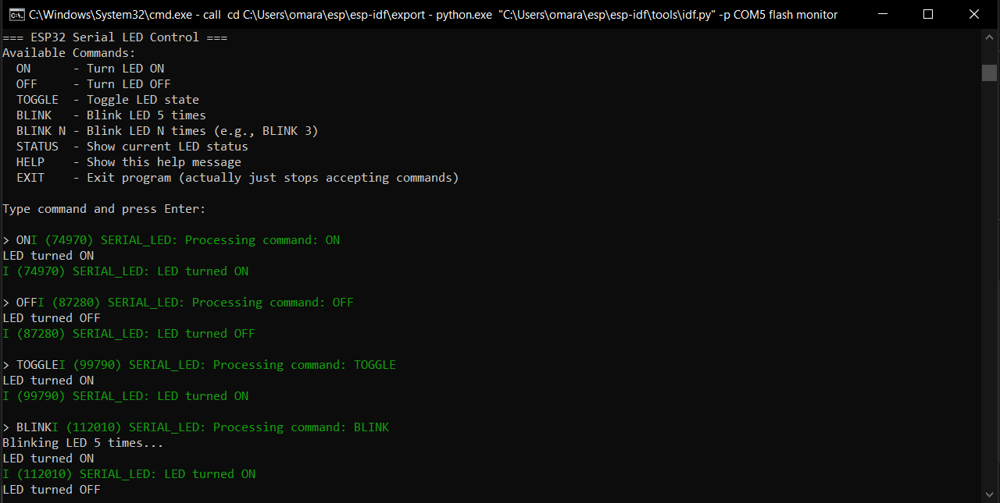
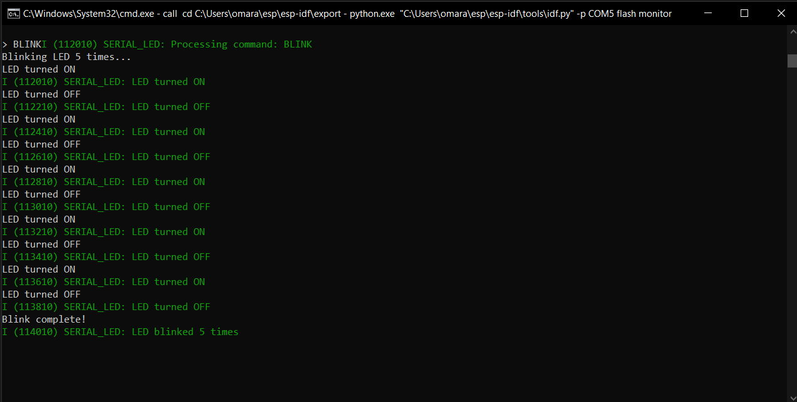
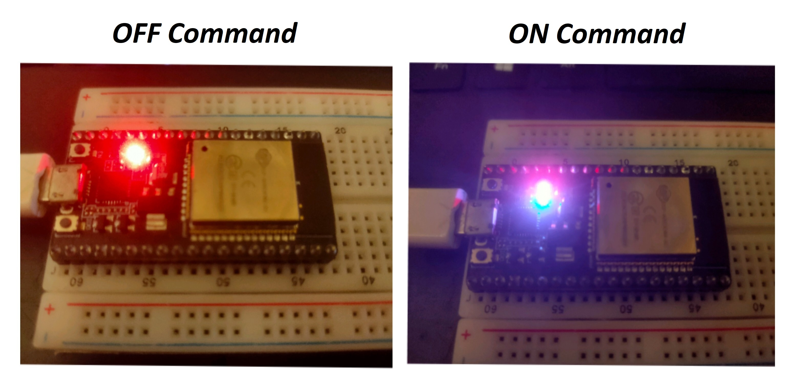

# ESP32 Serial LED Control

LED control via serial commands.

## Quick Start

### 1. Set Up ESP-IDF (One-time setup)

**Windows:**
```powershell
# Download ESP-IDF installer from:
# https://dl.espressif.com/dl/esp-idf/
# Run installer, then:
cd C:\esp\esp-idf
.\export.ps1
```

**Linux/Mac:**
```bash
mkdir -p ~/esp
cd ~/esp
git clone --recursive https://github.com/espressif/esp-idf.git
cd esp-idf
./install.sh
. ./export.sh
```

### 2. Create and Build Project

```bash
# Clone or create project
git clone <repository-url>
cd serial_led_control

# Set target and build
idf.py set-target esp32
idf.py build

# Flash to ESP32 (Windows)
idf.py -p COM3 flash monitor

# Flash to ESP32 (Linux/Mac)
idf.py -p /dev/ttyUSB0 flash monitor
```

## 📁 Project Structure
```
serial_led_control/
├── main/
│   ├── CMakeLists.txt          # Component configuration
│   └── serial_led.c            # Main source code
├── CMakeLists.txt              # Project configuration
└── README.md                   # This file
```

## Available Commands
Connect to serial at **115200 baud** and type:

| Command | Description | Example |
|---------|-------------|---------|
| `ON` | Turn LED ON | `ON` |
| `OFF` | Turn LED OFF | `OFF` |
| `TOGGLE` | Toggle LED state | `TOGGLE` |
| `BLINK` | Blink 5 times | `BLINK` |
| `BLINK N` | Blink N times | `BLINK 3` |
| `STATUS` | Show LED status | `STATUS` |
| `HELP` | Show command list | `HELP` |


## Terminal Usage Examples

### Windows (PowerShell):
```powershell
# Build and flash
idf.py build
idf.py -p COM3 flash monitor

# Just monitor serial output
idf.py -p COM3 monitor

# Exit monitor: Ctrl + ]
```

### Linux/Mac:
```bash
# Build and flash
idf.py build
idf.py -p /dev/ttyUSB0 flash monitor

# Serial monitor with screen
screen /dev/ttyUSB0 115200
# Exit: Ctrl+A, then k, then y
```


## Development

### Rebuild after changes:
```bash
idf.py build
idf.py -p COM3 flash
```

### Clean build:
```bash
idf.py fullclean
idf.py build
```
## Test

### Serial Monitor





### Board



## BLINK Command

